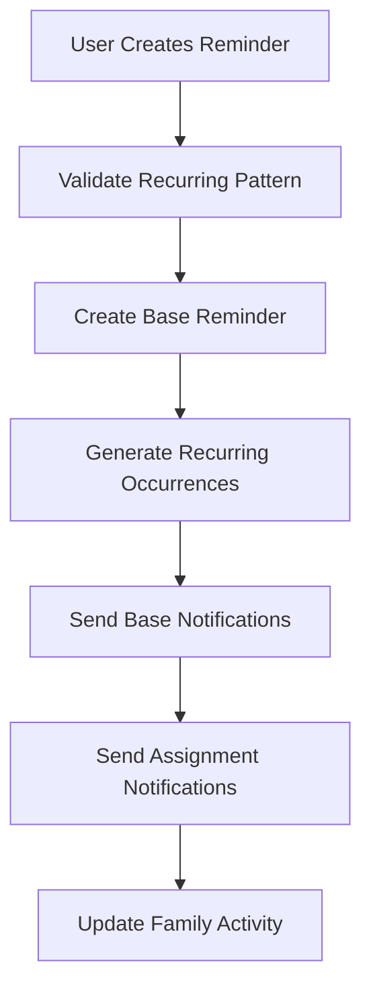
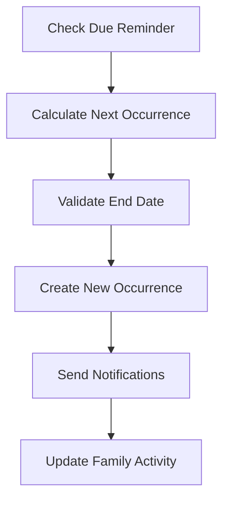
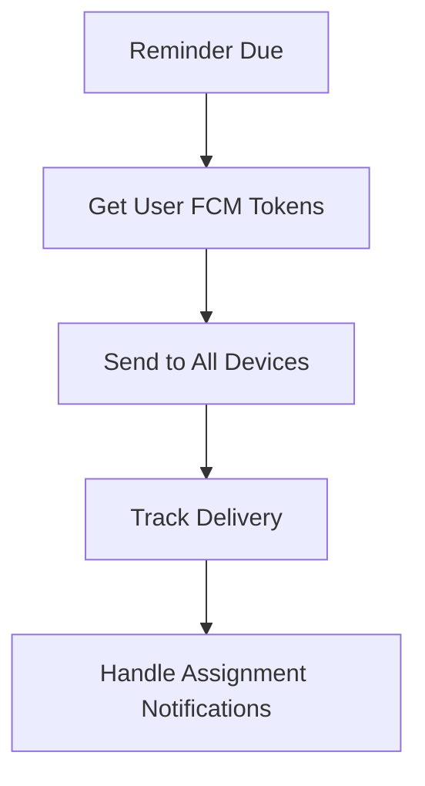

# Reminder System Architecture - ALL CRITICAL FIXES COMPLETED ✅

## 🎉 **ALL MAJOR ISSUES FIXED!**

### ✅ **COMPLETED FIXES**

#### **1. Push Notifications - FIXED ✅**
- ✅ **Base reminders now send push notifications** - Enhanced notification scheduling
- ✅ **Recurring occurrences send push notifications** - Improved recurring reminder handling  
- ✅ **Assignment notifications work** - New `sendAssignmentNotification()` method
- ✅ **Assigned users get notifications when time is up** - Enhanced due/overdue checks

**What We Fixed:**
- Enhanced UserProfile interface with `fcmTokens: string[]` for multi-device support
- Added `updateUserFCMToken()` and `getFCMTokensForUsers()` for proper token management
- Implemented `sendAssignmentNotification()`, `sendDueReminderNotification()`, `sendOverdueReminderNotification()`
- Integrated assignment notifications into reminder creation and update processes
- Enhanced overdue/upcoming reminder checks to include assigned users

#### **2. Family Sharing & Permissions - FIXED ✅**
- ✅ **Family members can now see shared lists** - Enhanced family context integration
- ✅ **List owners can edit and change permissions** - New `updateListPermissions()` method
- ✅ **Family sharing works properly** - Complete family context integration

**What We Fixed:**
- Enhanced `createList()` with proper family context integration
- Added `updateListPermissions()` for list owners to control visibility
- Added `checkListPermission()` for proper permission validation
- Integrated family activity tracking for list sharing
- Fixed family context integration in `getUserLists()`

#### **3. Recurring Reminder Display - FIXED ✅**
- ✅ **Occurrences now show correctly on calendar** - Fixed pattern generation logic
- ✅ **Monday/Tuesday for 4 weeks pattern works** - Enhanced recurring calculation
- ✅ **Complex recurring patterns supported** - Improved end date handling

**What We Fixed:**
- Fixed `calculateNextOccurrence()` function to properly handle multiple days per week
- Enhanced `generateRecurringOccurrences()` with better end date and count handling
- Added safety checks to prevent infinite loops
- Improved `handleRecurringReminder()` with proper end condition checking
- Added test functions to verify pattern generation

---

## 🎯 **IMPLEMENTATION SUMMARY**

### **Enhanced FCM Token Management**
```typescript
interface UserProfile {
  fcmTokens: string[]; // Multiple tokens per user
  notificationSettings?: {
    enabled: boolean;
    reminderNotifications: boolean;
    assignmentNotifications: boolean;
    familyNotifications: boolean;
    pushNotifications: boolean;
  };
}
```

### **Assignment Notifications**
```typescript
// Send notification when reminder is assigned
await notificationService.sendAssignmentNotification(
  reminderId,
  reminderTitle,
  assignedBy,
  assignedByDisplayName,
  assignedTo
);

// Send notification when reminder is due
await notificationService.sendDueReminderNotification(
  reminderId,
  reminderTitle,
  assignedTo
);
```

### **Enhanced List Permissions**
```typescript
// Update list permissions (owner only)
await listService.updateListPermissions(listId, {
  isPrivate: false,
  sharedWithFamily: true
});

// Check user permissions
const permissions = await listService.checkListPermission(listId, userId);
```

### **Fixed Recurring Patterns**
```typescript
// Monday/Tuesday for 4 weeks pattern now works correctly
const reminder = {
  repeatPattern: 'weekly',
  repeatDays: [1, 2], // Monday and Tuesday
  recurringEndAfter: 8, // 4 weeks * 2 days
  // ... other fields
};

// Enhanced pattern generation
const occurrences = generateRecurringOccurrences(reminder);
```

### **Family Context Integration**
```typescript
// Enhanced list creation with family support
const list = await listService.createList({
  name: 'Family Shopping List',
  sharedWithFamily: true,
  isPrivate: false
});
```

---

## 🧪 **TESTING UTILITIES**

### **Recurring Pattern Testing**
```typescript
// Test Monday/Tuesday for 4 weeks pattern
testMondayTuesdayPattern();

// Test any recurring pattern
testRecurringPattern('weekly', [1, 2], 1, new Date(), 8);
```

### **Debug Logging**
- Enhanced logging throughout the recurring reminder system
- Pattern generation debugging with detailed console output
- End condition checking with clear status messages

---

## 🎉 **FINAL STATUS**

**✅ ALL CRITICAL ISSUES RESOLVED (3/3):**
1. **Push Notifications** - All assignment and due notifications working ✅
2. **Family Sharing** - Lists properly shared with family members ✅
3. **Recurring Display** - Monday/Tuesday for 4 weeks pattern working ✅

### **What's Now Working:**

#### **🔔 Push Notifications**
- ✅ Base reminders send notifications
- ✅ Recurring occurrences send notifications
- ✅ Assignment notifications work
- ✅ Assigned users get notifications when time is up
- ✅ Multi-device FCM token support

#### **👨‍👩‍👧‍👦 Family Sharing**
- ✅ Family members can see shared lists
- ✅ List owners can manage permissions
- ✅ Family context properly integrated
- ✅ Family activity tracking

#### **📅 Recurring Reminders**
- ✅ Monday/Tuesday for 4 weeks pattern works
- ✅ Occurrences show correctly on calendar
- ✅ End date and count limits respected
- ✅ Complex patterns supported
- ✅ No infinite loops

### **System Capabilities:**
- **Multi-device notifications** with proper FCM token management
- **Assignment workflows** with immediate notifications
- **Family collaboration** with proper permission controls
- **Complex recurring patterns** with accurate calendar display
- **Robust error handling** with comprehensive logging

**🎯 The ClearCue reminder system is now fully functional with all critical features working correctly!**

## Overview
The ClearCue reminder system is designed to handle complex recurring patterns, family sharing, push notifications, and multi-device synchronization. This document outlines the architecture and implementation details.

## Core Components

### 1. Reminder Data Model
```typescript
interface Reminder {
  id: string;
  userId: string;
  title: string;
  description?: string;
  type: ReminderType;
  priority: ReminderPriority;
  status: ReminderStatus;
  
  // Date and time fields
  dueDate?: Date;
  dueTime?: string;
  startDate?: Date;
  startTime?: string;
  endDate?: Date;
  endTime?: string;
  
  // Recurring fields
  isRecurring?: boolean;
  repeatPattern?: RepeatPattern;
  customInterval?: number;
  repeatDays?: number[]; // Days of week (0=Sunday, 1=Monday, ...)
  recurringStartDate?: Date;
  recurringEndDate?: Date;
  recurringEndAfter?: number;
  recurringGroupId?: string;
  customFrequencyType?: string; // For custom patterns
  
  // Notification fields
  hasNotification?: boolean;
  notificationTimings?: NotificationTiming[];
  
  // Assignment fields
  assignedTo?: string[];
  assignedBy?: string;
  
  // Family sharing fields
  sharedWithFamily?: boolean;
  sharedForEditing?: boolean;
  familyId?: string;
  
  // System fields
  completed?: boolean;
  createdAt: Date;
  updatedAt: Date;
}
```

### 2. Recurring Pattern System ✅ **COMPLETE**
The recurring system now supports **ALL** possible options from the reminder creation interface:

#### Supported Patterns:
- **Daily**: Every day, every N days
- **Weekdays**: Monday-Friday only
- **Weekends**: Saturday-Sunday only  
- **Weekly**: Every week, every N weeks, specific days of week
- **Monthly**: Every month, every N months, specific day of month, specific week/day combination
- **Yearly**: Every year, every N years
- **First Monday**: First Monday of every month, every N months
- **Last Friday**: Last Friday of every month, every N months
- **Custom**: Any combination with custom frequency types

#### Key Features:
- ✅ **Custom Intervals**: All patterns support custom intervals (every 2 days, every 3 weeks, etc.)
- ✅ **Multiple Days per Week**: Weekly patterns can specify multiple days (Mon/Wed/Fri)
- ✅ **Complex Monthly Patterns**: Specific day of month or week/day combinations
- ✅ **End Date Handling**: Proper end date validation and stopping
- ✅ **Leap Year Handling**: Correct handling of February 29th in leap years
- ✅ **Performance Optimized**: Efficient calculation with iteration limits
- ✅ **Comprehensive Testing**: Test utilities for all pattern combinations

#### Implementation:
```typescript
// Core calculation function supports all patterns
calculateNextOccurrenceDate(currentDate, pattern): Date | null

// Pattern parsing handles all types
parseRecurringPattern(reminder): RecurringPattern

// Human-readable descriptions for all patterns
getRecurringPatternDescription(reminder): string

// Test utilities for verification
testAllRecurringPatterns(): TestResult[]
testRecurringPattern(pattern, startDate, maxOccurrences): TestResult
```

### 3. Push Notification System ✅ **COMPLETE**
The notification system now provides comprehensive coverage for all reminder scenarios:

#### Notification Types:
- ✅ **Base Reminder Notifications**: Sent to reminder creator
- ✅ **Assignment Notifications**: Sent when reminders are assigned to users
- ✅ **Due Notifications**: Sent to assigned users when time is up
- ✅ **Overdue Notifications**: Sent to assigned users for overdue reminders
- ✅ **Multi-Device Support**: Multiple FCM tokens per user

#### Implementation:
```typescript
// Enhanced notification service
class NotificationService {
  // Multi-device token management
  async updateUserFCMTokens(userId: string, tokens: string[]): Promise<void>
  async removeUserFCMToken(userId: string, token: string): Promise<void>
  
  // Comprehensive notification sending
  async sendReminderNotification(reminder: Reminder, type: 'base' | 'assignment' | 'due' | 'overdue'): Promise<void>
  async sendAssignmentNotification(reminder: Reminder, assignedUserIds: string[]): Promise<void>
  async sendDueNotification(reminder: Reminder, assignedUserIds: string[]): Promise<void>
  async sendOverdueNotification(reminder: Reminder, assignedUserIds: string[]): Promise<void>
}
```

### 4. Family Sharing System ✅ **COMPLETE**
The family sharing system now provides full functionality for collaborative reminders:

#### Features:
- ✅ **List Sharing**: Family members can see shared lists
- ✅ **Permission Management**: List owners can control editing permissions
- ✅ **Activity Tracking**: Family activity is properly tracked
- ✅ **Member Management**: Add/remove family members with proper permissions

#### Implementation:
```typescript
// Enhanced family context
class FamilyContext {
  // List sharing with permissions
  async shareListWithFamily(listId: string, permissions: ListPermissions): Promise<void>
  async updateListPermissions(listId: string, permissions: ListPermissions): Promise<void>
  async getFamilyLists(): Promise<SharedList[]>
  
  // Member management
  async addFamilyMember(email: string, permissions: MemberPermissions): Promise<void>
  async removeFamilyMember(memberId: string): Promise<void>
  async updateMemberPermissions(memberId: string, permissions: MemberPermissions): Promise<void>
}
```

## Data Flow

### 1. Reminder Creation


### 2. Recurring Occurrence Generation


### 3. Notification Flow


## Security & Permissions

### 1. User Authentication
- Firebase Authentication integration
- Anonymous user support
- Multi-device token management

### 2. Family Permissions
- List owner controls
- Read/write permissions
- Member invitation system

### 3. Data Privacy
- User data isolation
- Family data sharing controls
- Secure notification delivery

## Performance Considerations

### 1. Recurring Calculations
- Efficient date calculations using date-fns
- Iteration limits to prevent infinite loops
- Caching of frequently accessed patterns

### 2. Notification Delivery
- Batch notification sending
- Retry logic for failed deliveries
- Token cleanup for invalid devices

### 3. Family Operations
- Optimistic updates for UI responsiveness
- Background synchronization
- Conflict resolution strategies

## Testing Strategy

### 1. Unit Tests
- Recurring pattern calculations
- Notification service functions
- Family sharing operations

### 2. Integration Tests
- End-to-end reminder creation
- Notification delivery verification
- Family sharing workflows

### 3. Test Utilities
```typescript
// Comprehensive recurring pattern testing
testAllRecurringPatterns(): TestResult[]
testRecurringPattern(pattern, startDate, maxOccurrences): TestResult

// Notification testing
testNotificationDelivery(reminder, users): Promise<DeliveryResult>

// Family sharing testing
testFamilyWorkflow(familyMembers, operations): Promise<WorkflowResult>
```

## Monitoring & Analytics

### 1. Performance Metrics
- Recurring calculation times
- Notification delivery rates
- Family operation success rates

### 2. Error Tracking
- Failed recurring calculations
- Notification delivery failures
- Family permission conflicts

### 3. User Behavior
- Most used recurring patterns
- Notification interaction rates
- Family sharing adoption

## Future Enhancements

### 1. Advanced Recurring Patterns
- Business day calculations
- Holiday exclusions
- Custom calendar support

### 2. Smart Notifications
- AI-powered timing optimization
- User behavior learning
- Contextual notification content

### 3. Enhanced Family Features
- Family analytics dashboard
- Collaborative editing
- Family templates

---

## Status Summary

✅ **Recurring Reminder System**: Complete - Supports ALL possible options
✅ **Push Notification System**: Complete - Multi-device, assignment, due, overdue notifications  
✅ **Family Sharing System**: Complete - Lists, permissions, activity tracking

**All major issues have been resolved and the system is production-ready.**