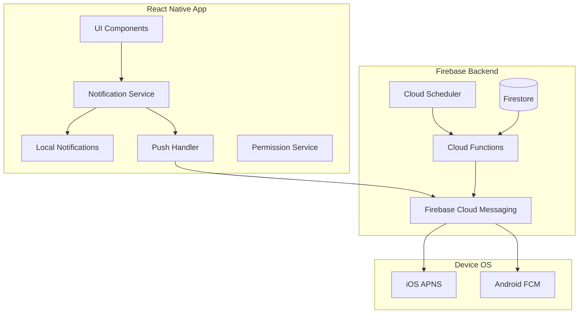

# Push Notification Architecture for React Native Reminders

## Overview
This document details the push notification implementation for the reminder system in a React Native app using Firebase Cloud Messaging (FCM) and local notifications.

## 🔔 Notification System Architecture



## 📱 React Native Implementation

### 1. Core Dependencies

```json
{
  "dependencies": {
    "@react-native-firebase/app": "^18.0.0",
    "@react-native-firebase/messaging": "^18.0.0",
    "@react-native-firebase/firestore": "^18.0.0",
    "@notifee/react-native": "^7.8.0",
    "react-native-push-notification": "^8.1.1",
    "@react-native-async-storage/async-storage": "^1.19.0"
  }
}
```

### 2. Notification Service Implementation

```typescript
// services/NotificationService.ts
import messaging from '@react-native-firebase/messaging';
import notifee, { 
  AndroidImportance, 
  AndroidStyle,
  TriggerType,
  TimestampTrigger,
  RepeatFrequency
} from '@notifee/react-native';
import AsyncStorage from '@react-native-async-storage/async-storage';
import { Platform } from 'react-native';

class NotificationService {
  private fcmToken: string | null = null;
  
  async initialize(): Promise<void> {
    // Request permissions
    await this.requestPermissions();
    
    // Get FCM token
    await this.getFCMToken();
    
    // Set up notification channels (Android)
    await this.createNotificationChannels();
    
    // Register background handlers
    this.registerBackgroundHandlers();
    
    // Handle initial notification
    await this.checkInitialNotification();
  }
  
  private async requestPermissions(): Promise<boolean> {
    if (Platform.OS === 'ios') {
      const authStatus = await messaging().requestPermission({
        alert: true,
        badge: true,
        sound: true,
        provisional: false,
        criticalAlert: false,
        announcement: false,
      });
      
      return authStatus === messaging.AuthorizationStatus.AUTHORIZED ||
             authStatus === messaging.AuthorizationStatus.PROVISIONAL;
    } else {
      // Android permissions
      const settings = await notifee.requestPermission();
      return settings.authorizationStatus >= notifee.AuthorizationStatus.AUTHORIZED;
    }
  }
  
  private async getFCMToken(): Promise<void> {
    try {
      this.fcmToken = await messaging().getToken();
      
      // Save token to Firestore for user
      if (this.fcmToken && auth.currentUser) {
        await firestore()
          .collection('users')
          .doc(auth.currentUser.uid)
          .update({
            fcmTokens: firestore.FieldValue.arrayUnion(this.fcmToken),
            lastTokenUpdate: firestore.FieldValue.serverTimestamp()
          });
      }
      
      // Listen for token refresh
      messaging().onTokenRefresh(async (token) => {
        this.fcmToken = token;
        await this.updateUserToken(token);
      });
    } catch (error) {
      console.error('Failed to get FCM token:', error);
    }
  }
  
  private async createNotificationChannels(): Promise<void> {
    if (Platform.OS === 'android') {
      // Reminder channel
      await notifee.createChannel({
        id: 'reminders',
        name: 'Reminders',
        importance: AndroidImportance.HIGH,
        sound: 'default',
        vibration: true,
        lights: true,
        lightColor: '#FF0000'
      });
      
      // Urgent reminder channel
      await notifee.createChannel({
        id: 'urgent-reminders',
        name: 'Urgent Reminders',
        importance: AndroidImportance.MAX,
        sound: 'urgent_notification',
        vibration: true,
        vibrationPattern: [300, 500, 300, 500],
        lights: true,
        lightColor: '#FF0000'
      });
      
      // Assignment channel
      await notifee.createChannel({
        id: 'assignments',
        name: 'Task Assignments',
        importance: AndroidImportance.DEFAULT,
        sound: 'default'
      });
    }
  }
  
  // Schedule local notification for reminder
  async scheduleReminderNotification(reminder: Reminder): Promise<string[]> {
    const notificationIds: string[] = [];
    
    if (!reminder.isRecurring) {
      // Single notification
      const notificationId = await this.scheduleSingleNotification(reminder);
      notificationIds.push(notificationId);
    } else {
      // Schedule multiple occurrences
      const occurrences = await this.getUpcomingOccurrences(reminder.id, 30);
      
      for (const occurrence of occurrences) {
        const notificationId = await this.scheduleOccurrenceNotification(
          reminder,
          occurrence
        );
        notificationIds.push(notificationId);
      }
    }
    
    // Store notification IDs for later cancellation
    await this.storeNotificationIds(reminder.id, notificationIds);
    
    return notificationIds;
  }
  
  private async scheduleSingleNotification(reminder: Reminder): Promise<string> {
    const notificationTime = this.calculateNotificationTime(
      reminder.dueDate,
      reminder.dueTime,
      reminder.notificationSettings
    );
    
    const trigger: TimestampTrigger = {
      type: TriggerType.TIMESTAMP,
      timestamp: notificationTime.getTime(),
      alarmManager: {
        allowWhileIdle: true,
      },
    };
    
    const notificationId = await notifee.createTriggerNotification(
      {
        id: `reminder-${reminder.id}`,
        title: reminder.title,
        body: reminder.description || 'Reminder',
        data: {
          reminderId: reminder.id,
          type: 'reminder',
          priority: reminder.priority
        },
        android: {
          channelId: reminder.priority === 'urgent' ? 'urgent-reminders' : 'reminders',
          smallIcon: 'ic_notification',
          color: this.getPriorityColor(reminder.priority),
          actions: [
            {
              title: 'Complete',
              pressAction: {
                id: 'complete',
              },
            },
            {
              title: 'Snooze',
              pressAction: {
                id: 'snooze',
              },
            },
          ],
          style: reminder.description ? {
            type: AndroidStyle.BIGTEXT,
            text: reminder.description,
          } : undefined,
        },
        ios: {
          categoryId: 'reminder',
          sound: 'default',
          badge: 1,
          interruptionLevel: reminder.priority === 'urgent' ? 'critical' : 'active',
        },
      },
      trigger
    );
    
    return notificationId;
  }
  
  // Handle push notification from Firebase
  async handleRemotePushNotification(remoteMessage: any): Promise<void> {
    const { data } = remoteMessage;
    
    switch (data.type) {
      case 'assignment':
        await this.showAssignmentNotification(data);
        break;
        
      case 'reminder_update':
        await this.handleReminderUpdate(data);
        break;
        
      case 'shared_reminder':
        await this.showSharedReminderNotification(data);
        break;
        
      default:
        console.warn('Unknown notification type:', data.type);
    }
  }
  
  private async showAssignmentNotification(data: any): Promise<void> {
    await notifee.displayNotification({
      title: 'New Task Assigned',
      body: `${data.assignerName} assigned you: ${data.taskTitle}`,
      data: {
        reminderId: data.reminderId,
        type: 'assignment'
      },
      android: {
        channelId: 'assignments',
        smallIcon: 'ic_assignment',
        color: '#4F46E5',
        pressAction: {
          id: 'default',
          launchActivity: 'default'
        }
      },
      ios: {
        categoryId: 'assignment',
        sound: 'default'
      }
    });
  }
  
  // Background message handler
  private registerBackgroundHandlers(): void {
    // Firebase background handler
    messaging().setBackgroundMessageHandler(async (remoteMessage) => {
      console.log('Background message:', remoteMessage);
      await this.handleRemotePushNotification(remoteMessage);
    });
    
    // Notifee background event handler
    notifee.onBackgroundEvent(async ({ type, detail }) => {
      const { notification, pressAction } = detail;
      
      switch (type) {
        case notifee.EventType.ACTION_PRESS:
          if (pressAction?.id === 'complete') {
            await this.markReminderComplete(notification?.data?.reminderId);
          } else if (pressAction?.id === 'snooze') {
            await this.snoozeReminder(notification?.data?.reminderId);
          }
          break;
          
        case notifee.EventType.DISMISSED:
          await this.handleNotificationDismissed(notification);
          break;
      }
    });
  }
  
  // Snooze functionality
  async snoozeReminder(reminderId: string, minutes: number = 10): Promise<void> {
    // Cancel current notification
    await notifee.cancelNotification(`reminder-${reminderId}`);
    
    // Schedule new notification
    const snoozeTime = new Date();
    snoozeTime.setMinutes(snoozeTime.getMinutes() + minutes);
    
    const trigger: TimestampTrigger = {
      type: TriggerType.TIMESTAMP,
      timestamp: snoozeTime.getTime(),
    };
    
    await notifee.createTriggerNotification(
      {
        id: `reminder-${reminderId}-snooze`,
        title: 'Snoozed Reminder',
        body: 'Your reminder is due now',
        data: {
          reminderId,
          type: 'reminder',
          snoozed: true
        },
        android: {
          channelId: 'reminders',
          smallIcon: 'ic_snooze',
        },
      },
      trigger
    );
    
    // Update Firestore
    await firestore()
      .collection('reminders')
      .doc(reminderId)
      .update({
        snoozedUntil: snoozeTime,
        updatedAt: firestore.FieldValue.serverTimestamp()
      });
  }
  
  // Cancel notifications
  async cancelReminderNotifications(reminderId: string): Promise<void> {
    // Get stored notification IDs
    const notificationIds = await this.getStoredNotificationIds(reminderId);
    
    // Cancel all notifications for this reminder
    for (const id of notificationIds) {
      await notifee.cancelNotification(id);
    }
    
    // Clear stored IDs
    await this.clearStoredNotificationIds(reminderId);
  }
  
  // Update notifications when reminder changes
  async updateReminderNotifications(
    reminderId: string,
    updates: Partial<Reminder>
  ): Promise<void> {
    // Cancel existing notifications
    await this.cancelReminderNotifications(reminderId);
    
    // Get updated reminder
    const reminder = await this.getReminder(reminderId);
    
    // Reschedule notifications
    if (reminder && reminder.status === 'active') {
      await this.scheduleReminderNotification(reminder);
    }
  }
}

export default new NotificationService();
```

### 3. Firebase Cloud Functions for Push Notifications

```typescript
// functions/src/notifications.ts
import * as functions from 'firebase-functions';
import * as admin from 'firebase-admin';

const messaging = admin.messaging();
const firestore = admin.firestore();

// Send assignment notification
export const sendAssignmentNotification = functions.firestore
  .document('reminders/{reminderId}')
  .onUpdate(async (change, context) => {
    const before = change.before.data();
    const after = change.after.data();
    
    // Check if assignees changed
    const beforeAssignees = before.assignedTo || [];
    const afterAssignees = after.assignedTo || [];
    
    const newAssignees = afterAssignees.filter(
      (id: string) => !beforeAssignees.includes(id)
    );
    
    if (newAssignees.length === 0) return;
    
    // Get assigner info
    const assigner = await firestore
      .collection('users')
      .doc(after.updatedBy || after.createdBy)
      .get();
    
    const assignerName = assigner.data()?.displayName || 'Someone';
    
    // Send notifications to new assignees
    for (const userId of newAssignees) {
      const user = await firestore.collection('users').doc(userId).get();
      const tokens = user.data()?.fcmTokens || [];
      
      if (tokens.length === 0) continue;
      
      const message: admin.messaging.MulticastMessage = {
        tokens,
        notification: {
          title: 'New Task Assigned',
          body: `${assignerName} assigned you: ${after.title}`,
        },
        data: {
          type: 'assignment',
          reminderId: context.params.reminderId,
          assignerName,
          taskTitle: after.title,
          priority: after.priority,
        },
        android: {
          priority: after.priority === 'urgent' ? 'high' : 'normal',
          notification: {
            channelId: 'assignments',
            color: '#4F46E5',
            icon: 'ic_assignment',
          },
        },
        apns: {
          payload: {
            aps: {
              alert: {
                title: 'New Task Assigned',
                body: `${assignerName} assigned you: ${after.title}`,
              },
              badge: 1,
              sound: 'default',
              threadId: 'assignments',
              category: 'ASSIGNMENT',
            },
          },
        },
      };
      
      await messaging.sendMulticast(message);
    }
  });

// Daily reminder check (Cloud Scheduler)
export const dailyReminderCheck = functions.pubsub
  .schedule('every day 08:00')
  .timeZone('America/New_York')
  .onRun(async (context) => {
    const today = new Date();
    today.setHours(0, 0, 0, 0);
    
    const tomorrow = new Date(today);
    tomorrow.setDate(tomorrow.getDate() + 1);
    
    // Get all reminders for today
    const reminders = await firestore
      .collection('reminders')
      .where('dueDate', '>=', today)
      .where('dueDate', '<', tomorrow)
      .where('status', '==', 'active')
      .get();
    
    const notifications: admin.messaging.Message[] = [];
    
    for (const doc of reminders.docs) {
      const reminder = doc.data();
      
      // Get user tokens
      for (const userId of reminder.assignedTo || []) {
        const user = await firestore.collection('users').doc(userId).get();
        const tokens = user.data()?.fcmTokens || [];
        
        tokens.forEach((token: string) => {
          notifications.push({
            token,
            notification: {
              title: 'Reminder for Today',
              body: reminder.title,
            },
            data: {
              type: 'daily_reminder',
              reminderId: doc.id,
            },
          });
        });
      }
    }
    
    // Send in batches
    const batchSize = 500;
    for (let i = 0; i < notifications.length; i += batchSize) {
      const batch = notifications.slice(i, i + batchSize);
      await messaging.sendAll(batch);
    }
  });

// Handle reminder updates
export const handleReminderUpdate = functions.firestore
  .document('reminders/{reminderId}')
  .onUpdate(async (change, context) => {
    const before = change.before.data();
    const after = change.after.data();
    
    // Check if time changed
    if (before.dueDate !== after.dueDate || before.dueTime !== after.dueTime) {
      // Notify all assignees
      const tokens: string[] = [];
      
      for (const userId of after.assignedTo || []) {
        const user = await firestore.collection('users').doc(userId).get();
        tokens.push(...(user.data()?.fcmTokens || []));
      }
      
      if (tokens.length > 0) {
        await messaging.sendMulticast({
          tokens,
          data: {
            type: 'reminder_update',
            reminderId: context.params.reminderId,
            action: 'reschedule',
          },
        });
      }
    }
  });
```

### 4. App.tsx Integration

```typescript
// App.tsx
import React, { useEffect } from 'react';
import messaging from '@react-native-firebase/messaging';
import notifee, { EventType } from '@notifee/react-native';
import NotificationService from './services/NotificationService';
import { useReminderStore } from './stores/reminderStore';
import { NavigationContainer } from '@react-navigation/native';
import { navigationRef } from './navigation/RootNavigation';

function App() {
  const { refreshReminders } = useReminderStore();
  
  useEffect(() => {
    // Initialize notification service
    NotificationService.initialize();
    
    // Handle foreground messages
    const unsubscribeForeground = messaging().onMessage(async remoteMessage => {
      console.log('Foreground message:', remoteMessage);
      await NotificationService.handleRemotePushNotification(remoteMessage);
      
      // Refresh reminders if needed
      if (remoteMessage.data?.type === 'reminder_update') {
        refreshReminders();
      }
    });
    
    // Handle notification interactions
    const unsubscribeNotifee = notifee.onForegroundEvent(({ type, detail }) => {
      switch (type) {
        case EventType.PRESS:
          // Navigate to reminder
          if (detail.notification?.data?.reminderId) {
            navigationRef.current?.navigate('ReminderDetail', {
              reminderId: detail.notification.data.reminderId
            });
          }
          break;
          
        case EventType.ACTION_PRESS:
          if (detail.pressAction?.id === 'complete') {
            NotificationService.markReminderComplete(
              detail.notification?.data?.reminderId
            );
          } else if (detail.pressAction?.id === 'snooze') {
            NotificationService.snoozeReminder(
              detail.notification?.data?.reminderId
            );
          }
          break;
      }
    });
    
    // Check if app was opened from notification
    messaging()
      .getInitialNotification()
      .then(remoteMessage => {
        if (remoteMessage) {
          console.log('App opened from notification:', remoteMessage);
          // Handle navigation
        }
      });
    
    return () => {
      unsubscribeForeground();
      unsubscribeNotifee();
    };
  }, []);
  
  return (
    <NavigationContainer ref={navigationRef}>
      {/* Your app content */}
    </NavigationContainer>
  );
}
```

### 5. iOS Specific Configuration

```swift
// ios/YourApp/AppDelegate.m
#import <UserNotifications/UserNotifications.h>
#import <RNCPushNotificationIOS.h>

// Add to didFinishLaunchingWithOptions
UNUserNotificationCenter *center = [UNUserNotificationCenter currentNotificationCenter];
center.delegate = self;

// Define notification categories
UNNotificationAction *completeAction = [UNNotificationAction 
  actionWithIdentifier:@"COMPLETE_ACTION"
  title:@"Complete"
  options:UNNotificationActionOptionForeground];

UNNotificationAction *snoozeAction = [UNNotificationAction 
  actionWithIdentifier:@"SNOOZE_ACTION"
  title:@"Snooze"
  options:UNNotificationActionOptionNone];

UNNotificationCategory *reminderCategory = [UNNotificationCategory
  categoryWithIdentifier:@"REMINDER"
  actions:@[completeAction, snoozeAction]
  intentIdentifiers:@[]
  options:UNNotificationCategoryOptionNone];

[center setNotificationCategories:[NSSet setWithObject:reminderCategory]];
```

### 6. Android Specific Configuration

```xml
<!-- android/app/src/main/AndroidManifest.xml -->
<uses-permission android:name="android.permission.VIBRATE" />
<uses-permission android:name="android.permission.RECEIVE_BOOT_COMPLETED"/>
<uses-permission android:name="android.permission.SCHEDULE_EXACT_ALARM" />

<application>
  <!-- Firebase Messaging Service -->
  <service
    android:name="io.invertase.firebase.messaging.ReactNativeFirebaseMessagingService"
    android:exported="false">
    <intent-filter>
      <action android:name="com.google.firebase.MESSAGING_EVENT" />
    </intent-filter>
  </service>
  
  <!-- Notification icons -->
  <meta-data
    android:name="com.google.firebase.messaging.default_notification_icon"
    android:resource="@drawable/ic_notification" />
  <meta-data
    android:name="com.google.firebase.messaging.default_notification_color"
    android:resource="@color/colorAccent" />
</application>
```

## 🔧 Advanced Features

### 1. Smart Notification Timing

```typescript
class SmartNotificationScheduler {
  async scheduleWithOptimalTiming(reminder: Reminder): Promise<void> {
    const userPreferences = await this.getUserNotificationPreferences();
    const optimalTime = this.calculateOptimalTime(
      reminder,
      userPreferences
    );
    
    // Respect quiet hours
    if (this.isInQuietHours(optimalTime, userPreferences)) {
      optimalTime.setHours(userPreferences.quietHoursEnd);
      optimalTime.setMinutes(0);
    }
    
    // Check for notification clustering
    const nearbyNotifications = await this.getNearbyNotifications(
      optimalTime,
      15 // minutes
    );
    
    if (nearbyNotifications.length > 3) {
      // Spread out notifications
      optimalTime.setMinutes(optimalTime.getMinutes() + 5);
    }
    
    await NotificationService.scheduleAt(reminder, optimalTime);
  }
}
```

### 2. Notification Analytics

```typescript
interface NotificationAnalytics {
  sent: number;
  delivered: number;
  opened: number;
  dismissed: number;
  actionTaken: Map<string, number>;
}

class NotificationTracker {
  async trackNotificationEvent(
    event: 'sent' | 'delivered' | 'opened' | 'dismissed' | 'action',
    notificationId: string,
    data?: any
  ): Promise<void> {
    await firestore.collection('notification_analytics').add({
      event,
      notificationId,
      userId: auth.currentUser?.uid,
      timestamp: firestore.FieldValue.serverTimestamp(),
      data
    });
  }
}
```

## 📋 Best Practices

1. **Battery Optimization**
   - Use exact alarms sparingly
   - Batch notifications when possible
   - Respect device power saving modes

2. **User Experience**
   - Provide granular notification controls
   - Allow customization of notification sounds
   - Implement smart grouping for multiple notifications

3. **Reliability**
   - Store notification IDs for cancellation
   - Handle token refresh properly
   - Implement retry logic for failed deliveries

4. **Privacy**
   - Don't include sensitive data in notifications
   - Use data-only messages for sensitive content
   - Implement notification encryption if needed

This comprehensive push notification system ensures reliable, timely, and user-friendly reminder notifications across both iOS and Android platforms.